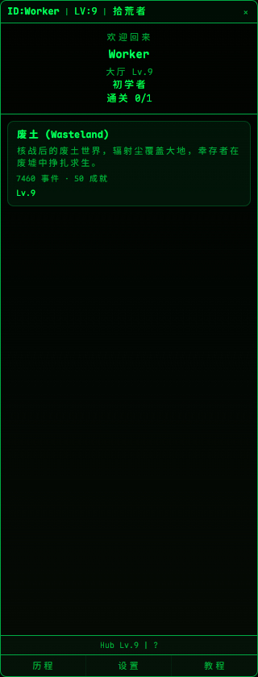
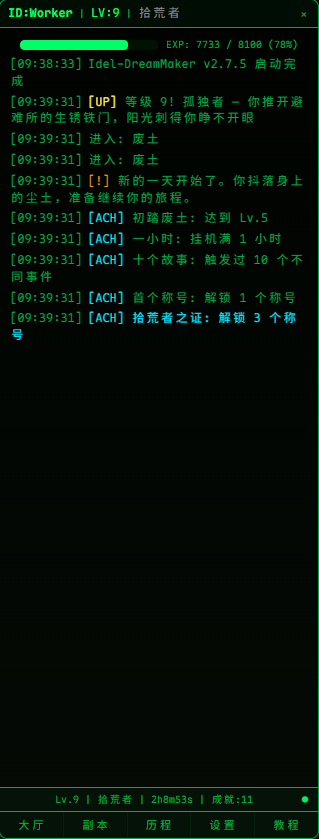
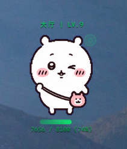
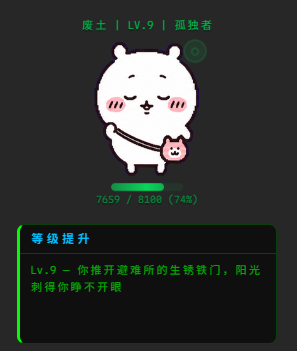

# Idel-DreamMaker

> 原名 IdleWorker，v0.3.0 起改名 Idel-DreamMaker。

## 这是什么？

Idel-DreamMaker 是一个藏在系统托盘里的宠物陪伴挂机游戏。你不需要操作什么——选一个故事世界进入，它就在后台自动挂机、自动升级、自动触发剧情、自动解锁成就。

**核心玩法就三步：**
1. 选一个副本（故事世界）
2. 挂着，看故事自己展开
3. 解锁称号/成就，体验一段完整人生

每个副本是独立的人生剧本——废土求生、修仙问道、赛博冒险……目前内置了「废土」副本（5000+ 条事件，4 周目体验），你也可以自己写副本或导入别人分享的。

## 适合谁？

| 人群 | 为什么适合 |
|------|-----------|
| **上班族/学生党** | 挂在系统托盘里，偶尔瞄一眼发生了什么，不耽误工作学习 |
| **喜欢看故事的人** | 每个副本 500+ 剧情事件，纯文字叙事，零操作打断 |
| **像素宠物爱好者** | 支持 PetDex 社区精灵，宠物常驻桌面互动 |
| **爱折腾的玩家** | 自己写 .md 副本文件丢进去就是新游戏，也可以分享给别人 |
| **闲得慌的人** | 挂着看等级慢慢涨，有种奇妙的满足感 |

## 特色功能

| 功能 | 说明 |
|------|------|
| **系统托盘常驻** | 缩在托盘里，不占桌面空间，需要时才显示 |
| **像素宠物** | 支持 PetDex 社区精灵，桌面常驻，单击/双击/右键交互 |
| **副本系统** | 每个副本独立游戏体验，500 级成长曲线，多周目重生 |
| **丰富剧情** | 废土副本含 5000+ 条事件（剧情+日常），节假日专属事件 |
| **自制副本** | 写个 .md 文件丢进 scenarios_user/，重启就能玩 |
| **自制副本** | 设置面板打开副本文件夹，丢 .md 文件进去，点「刷新」即可；也支持导入分享的 .md 文件 |
| **成就称号** | 每副本 50 个成就 + 30 个称号，大厅跨副本聚合 |
| **挂机变体** | 不同副本有不同机制（修仙白天快晚上慢、潮汐每 6 小时一波……）|
| **零交互** | 进入副本后全自动运行，没有按钮、点击、选择分支 |
| **整点报时** | 每半小时宠物气泡报时，显示当前时间，6 秒自动消失，可右键关闭 |
| **多主题** | 9 套配色 + 自定义调色，总有一款顺眼 |
| **跨平台** | Windows 已测试，macOS/Linux 代码已适配 |

## 截图

| 大厅界面 | 副本内挂机 |
|---------|-----------|
|  |  |

| 宠物窗口 | 事件弹窗 |
|---------|---------|
|  |  |

## 快速开始

```bash
# 安装依赖
npm install

# 构建副本数据 + 启动开发模式
npm run electron:dev
```

## 制作自己的副本

1. 在 `scenarios/` 或 `scenarios_user/` 下创建一个 `.md` 文件
2. 按照 `docs/format-rules.md` 的格式填写
3. 重启游戏即可自动加载

详情见 [创建副本指南](docs/creating-scenarios.md)。

## 打包

```bash
npm run electron:build
```

Windows 打包 → `release/Idel-DreamMaker 版本.exe`
Linux 打包 → `npx electron-builder --linux`

## 技术栈

| 类别 | 技术 |
|------|------|
| 桌面框架 | Electron 34.x |
| 后端 | JavaScript (Node.js 22.x) |
| 前端 | HTML + CSS + JS（无框架） |
| 构建 | Vite 6.x + electron-builder 25.x |
| 字体 | [Maple Mono NF CN](https://github.com/subframe7536/maple-font) (OFL-1.1) |

## 文档

- [副本格式规范](docs/format-rules.md)
- [创建副本教程](docs/creating-scenarios.md)
- [AI 辅助创作模板](docs/ai-prompt-template.md)

## 文件结构

```
index.html              主 HTML 入口
src/main.js             前端逻辑
src/style.css           前端样式
src/scenario.js         数据模型模块
src/scenario-parser.cjs 副本 .md 解析器（共享模块）
electron/
  main.cjs              Electron 主进程（窗口、游戏循环、存档）
  preload.cjs           IPC 桥接
  tray.cjs              系统托盘
  windows.cjs           窗口管理
  pet.cjs               宠物窗口
  holiday.cjs           节假日模块
  *.cjs                 其他子窗口管理
pet/                    宠物窗口前端
pet-bubble/             事件气泡窗口
pet-context-menu/       右键菜单窗口
pet-selector/           宠物选择器窗口
scenarios/              内置副本 .md 源文件
scenarios_user/         玩家自制副本（新建，已 gitignore）
public/
  scenarios_data.json   构建时生成的副本数据（由 build.js 从 scenarios/ 生成）
  fonts/                打包字体
docs/                   文档
build.js                副本构建脚本
```

## 版权声明

- 像素宠物精灵为玩家自行下载的用户数据（`%APPDATA%/Idel-DreamMaker/pets/`）。应用不捆绑、不分发任何精灵文件。精灵版权归各自创作者或 IP 权利人。下载地址：https://petdex.dev/
- 字体 [Maple Mono NF CN](https://github.com/subframe7536/maple-font) 使用 SIL Open Font License 1.1
